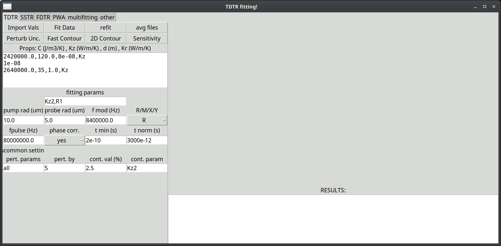

This is a python code package for analyzing Time Domain Thermoreflectance (TDTR) data, based on the analytical model from Cahill 2004 (a copy of which is available in the References folder). The math is the same for Frequency Domain Thermoreflectance (FDTR, Schmidt 2009), Steady State Thermoreflectance (SSTR, Braun 2019), and Square Pulse Thermoreflectance (SPTR, Wang 2022). 

This code comes in two parts: 
- TDTR_fitting.py - contains all the required functions (analytical model solved in Fourier space, functions which generate the model curve for each measurement type, fitting functions, sensitivity analysis, monte carlo uncertainty, contour analysis)
- gui.py - a rudimentary graphical user interface which calls on the functions inside TDTR_fitting.py
The code also relies on https://github.com/ExSiTE-Lab/niceplot for plotting

Most users will want to use the GUI. If you're on mac or linux, you can simply download and run "TDTRfitting_git.sh". If you're on windows, you can use "TDTRfitting_git.bat". These should download all required files and kick off the gui (you will always have the latest version of the code!)

coding-saavy users may find it convenient to write their own python code, importing and calling the functions from TDTR_fitting.py. An example of this is in fitting_external.py. This is useful when fitting large datasets comprised of many many acquisitions. 

